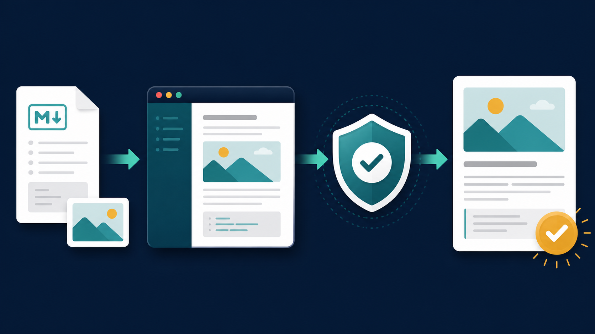

# 從 Unity Game Dev 到 Orchestration

這次鐵人賽的主題是 **From (Unity) Game Dev to Orchestration of (Unity) Game Dev**。

過去做 Unity Game Dev 時，我們直接操作 Editor、修改 C#、調整 Scene 和 Prefab、進入 Play Mode、查看 Console，最後再建立 Build。當 AI Agent 進入開發流程後，目標不只是請它「幫我寫一段程式」，而是逐步把這些工作整理成可以規劃、執行、驗證、復原與交接的流程。

這就是我所說的 Orchestration：人不必親手完成每一個操作，而是設計 Agent 如何取得 context、選擇工具、分解工作、接收回饋，並在安全邊界內繼續前進。

Day 001 先從一個離 Unity Editor 稍遠、但每天都會用到的任務開始：讓 Agent 接手鐵人賽文章的發文流程。



## 為什麼第一天先做自動發文？

發文自動化不會佔滿 30 天。它是一個規模夠小、卻能涵蓋完整 orchestration loop 的垂直案例：

1. Agent 要理解本機文章、frontmatter、圖片與預定日期。
2. 它要操作 TypeScript toolchain 和瀏覽器，而不只是產生文字。
3. 它要保存登入狀態、草稿 URL、內容雜湊與圖片對應。
4. 它要先觀察網站，再決定是否建立、更新或停止。
5. 它要在動作後重新取得證據，不能把「點過按鈕」當成成功。

這些能力之後都會回到 Unity：讀取專案狀態、修改程式與資產、啟動 Editor 或 Build、分析測試與 Console，再決定下一個行動。

## 文章也是 repository 裡的工作單元

本機檔案是文章的 source of truth：

```text
articles/
└─ day-001/
   ├─ index.md
   └─ ref-image-001.png
```

每篇文章是一個獨立目錄。`index.md` 保存內容與 frontmatter，引用的圖片則和文章放在一起。Agent 可以直接編輯、檢查及版本控制，不需要把網站草稿當成唯一資料來源。

```yaml
---
title: Day 001：從 Unity Game Dev 到 Orchestration——先讓 Agent 接手發文流程
timestamp: "2026-09-01T10:17:00+08:00"
tags:
  - Unity
  - AI Agent
  - Vibe Coding
---
```

## Observe、Act、Verify

目前的 TypeScript + Playwright 流程分成三個階段。

### Observe

- 以 `Asia/Taipei` 計算今天應該發布 Day N。
- 驗證 frontmatter、timestamp、Markdown 與本機圖片。
- 確認登入帳號、鐵人系列名稱與 `Vibe Coding` 分類。
- 先讀公開頁，判斷今天是否已經發布。
- 精準尋找同標題草稿，不把無標題草稿當成目標。

### Act

- 草稿不存在就建立，存在則同步最新內容。
- 只上傳有變更的圖片，再把本機路徑換成網站託管 URL。
- 儲存後讀回標題與 Markdown；內容不一致就停止。
- 只有 dry-run、安全鎖與使用者授權都成立時，才進入發布動作。

### Verify

- 發布後重新讀公開頁。
- 必須找到今天、同標題的文章，才算完成。
- 失敗時保留 structured log、trace、截圖與 HTML，供下一次診斷。

每天可以安排兩次執行。第一次成功後，第二次會在公開頁檢查階段停止，因此重試不會多發下一篇。

## 用 SHA-256 保存內容狀態

本機內容會產生兩種 canonical SHA-256：

- `sourceHash`：標題、timestamp、排序後的標籤、Markdown，以及每張本機圖片的內容雜湊。
- `renderedHash`：圖片路徑換成網站 URL 後，實際送入 editor 的內容。

每張圖片也有自己的 SHA-256。檔案沒有改變時，可以沿用先前上傳後取得的 URL；公開文章發布後若本機內容又改動，目前只回報差異，不讓背景排程偷偷改寫文章。

這和 Unity 的 Library cache 或資產 dependency graph 不是同一件事，但背後的問題很接近：如果 Agent 不知道「什麼改過、什麼已驗證、什麼可以重用」，它就很難可靠地協調長時間工作。

## 把同一個迴圈帶回 Unity

接下來的重點會從發文工具回到 Unity Game Dev：

| 發文案例 | Unity Orchestration |
|---|---|
| Markdown 與圖片 | C#、Scene、Prefab 與資產 |
| Playwright 操作網站 | Agent 操作 Editor、CLI 與 Build pipeline |
| 讀回草稿內容 | Compile、Test、Console 與 Play Mode 回饋 |
| 公開頁驗證 | 可執行 Build 與遊戲行為驗證 |
| dry-run 與發布安全鎖 | 變更範圍、人工 gate 與版本控制 |

Day 001 先證明一個 Agent workflow 不能只有「生成」，還要包含 context、tool use、state、feedback 和 governance。下一篇會建立 Unity Game Dev 的基準流程，再開始判斷哪些步驟適合交給 Agent，哪些應該由 orchestrator 或人保留控制權。
