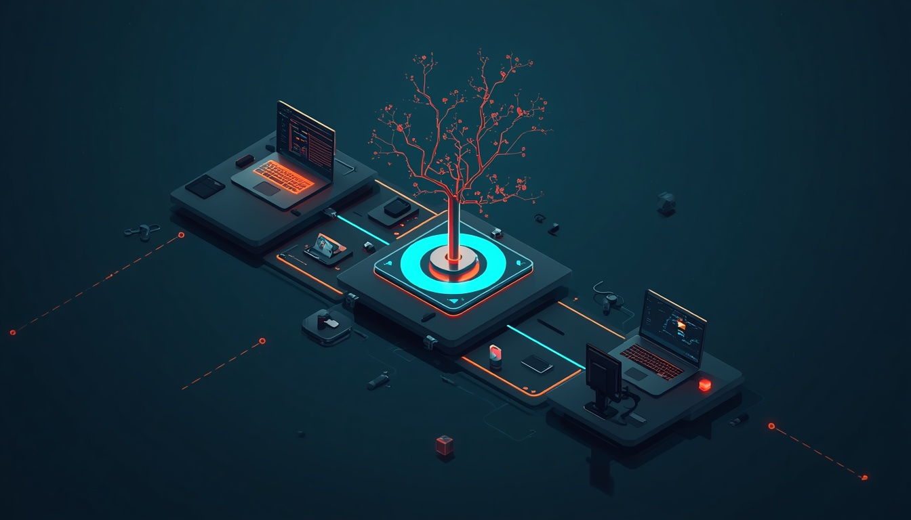
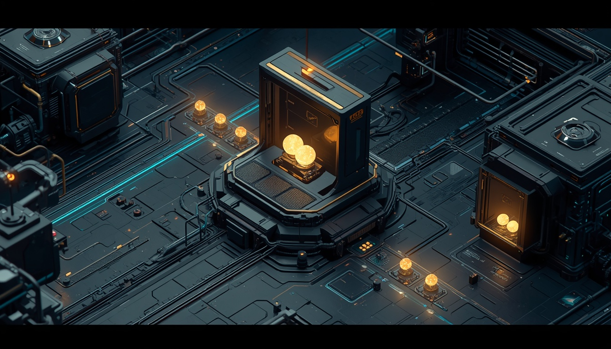

# 先讓 Agent 活得比視窗久



昨天先把 Agent Development Environment（ADE）的地圖畫出來：Client 是入口，Station 才擁有 Agent、process、workspace 與 state。也提到 BearPunch 已經通過第一個 D0 lifecycle gate。

不過，「Client 關掉後 Agent 還會繼續跑」聽起來很像一句普通的背景執行需求。真正開始實作後，才會發現它同時牽動 process ownership、事件持久化、重新連線、取消語意，以及系統到底憑什麼宣稱工作真的發生過。

所以在回到 Unity Game Dev 的基準流程前，Day 003 先把 D0 拆開來看：**我們如何證明 Agent 的生命週期不再綁在某一個視窗上？**

## 第一個核心假設：Client 不是 Agent 的主人

傳統桌面工具很容易形成這樣的結構：視窗啟動 child process，狀態保存在 UI 記憶體裡；視窗一關，process、輸出與控制權也一起消失。即使把 process 改成背景執行，若沒有其他地方保存 session identity、event history 與取消權限，仍然只是「一個比較不容易被看見的 child process」。

BearPunch 把 ownership 移到持續運作的 Station：

```text
Client A ── request ──▶ Station ──▶ provider process
   │                       ├─ session state
   │ disconnect            ├─ canonical events
   ▼                       └─ process tree

Client B ── attach ───▶ 同一個 Station、同一個 session
```

Client 可以是 CLI、TUI、未來的桌面 ADE，甚至另一台裝置。它負責送出 intent 與呈現結果，但不直接成為 provider process 的父層，也不把 session 的唯一真相留在自己的記憶體裡。

這個切法也帶來一個很實際的判準：如果關閉 Client 會讓 Agent 死掉，或換一個 Client 就只能重新跑一次，那還沒有跨過 ADE 最基本的生命週期邊界。

## D0 怎麼把「持續運作」變成可驗證事實？



D0 沒有先追求漂亮介面，而是設計一條可以重複、可以失敗，也可以留下證據的最小流程。省略參數後，它大致長這樣：

```text
沒有 Station → spawn 必須拒絕
啟動 Station → spawn mock session
Client A wait → timeout 後離開
Client B attach → wait / history 同一個 session
cancel → root 與 grandchild 都消失
再跑一次真實 Claude session
```

這裡每一步都在排除一種「看起來有成功」的假象。

### 沒有 Station，就不能偷偷降級

如果 Client 找不到 Station，`spawn` 必須 fail closed，而不是自行啟動 provider，再假裝兩條路徑具有相同語意。否則有時由 Station 擁有 process，有時由 Client 擁有，重新連線與取消保證就會隨啟動方式改變。

### Timeout 不等於工作失敗

第一個 Client 對 mock session 執行短時間 `wait`，預期先得到 timeout，然後結束。timeout 只代表「這個 Client 不再等」，不是要求 Station 停止 session。稍後第二個 Client 再連回同一個 Station，仍能看到 session 完成。

這個差異對長時間任務很重要。編譯、測試或 Build 超過某個畫面的等待時間，不應因此被錯誤標成失敗，更不應直接被殺掉。

### 重新連線不是重新產生一份相似輸出

第二個 Client 讀到「差不多的文字」還不夠。D0 比較的是 canonical event 的 sequence、event identity 與內容雜湊；另一個 Client 重播的四筆事件，必須和第一個 Client 以及 SQLite 直接讀出的結果一致。

因此可以區分兩件很容易混在一起的事：

- **retry**：重新執行一次，產生新的 session 與新事件；
- **reattach**：接回原本的 session，讀取同一批已保存的事實。

現行實作也讓 Station 自己持續讀取 provider event stream，而不是要求某個 `wait` Client 一直在線。Client 可以離開，但事件仍由擁有 session 的一端保存。

## 取消不是送出 kill，而是確認整棵 process tree 消失

Agent 很少永遠只是一個 process。它可能再啟動 shell、編譯器、測試器或其他工具。只終止最上層 PID，畫面也許已經顯示 cancelled，背景卻可能仍有 child process 寫檔、占用鎖或消耗資源。

D0 的 mock 特別建立 root 與 grandchild。BearPunch 在 Windows 上由 Station 透過 Job Object 擁有這棵 process tree；取消 session 時，必須確認 root 和 grandchild 都已經消失，才回報 `cancelled`。

這裡驗證的不是「有呼叫取消 API」，而是取消後的外部世界真的符合宣稱。對 Unity workflow 而言，這會直接影響 Editor、asset import、compiler、test runner 與 Build 子程序能否被可靠回收。

D0 最後也跑了一次真實 Claude CLI session，將 completion 與 usage 正規化成共同事件。可重現的 mock 負責驗證邊界條件；真 provider 則確認這套模型不只在測試替身上成立。

## D0 通過後，今天的 BearPunch 到哪裡了？

截至 2026 年 9 月 3 日，我只把本機 `main` 已合併的程式與 committed evidence 算成完成；還在 worktree、尚未驗證或只有規劃文件的內容，不列入成果。

| 能力 | 目前可驗證狀態 |
|---|---|
| Station lifecycle | D0 已通過；Client 可離開，session 與 canonical events 由 Station 保存 |
| Provider adapter | 已發布 mock、Claude、Codex、OpenCode 四個 Builtin Rust adapter；Kiro CLI 目前只有 manifest，還不是可執行 adapter |
| Self-dispatch | 已有 `run create/show/list/wait/collect/verify`，BearPunch 能用自己的 Station CLI 派工與驗證 repository 工作 |
| Workspace 與 sandbox | ProjFS + MXC 的 D2b 證據已涵蓋隔離、不可變 base、重啟 reconcile 與 unavailable 時 fail closed |
| 可見介面 | 已有 OpenTUI station-board，可看 stations、sessions、runs 與 worktrees；它不是桌面 ADE |
| 桌面 ADE | 尚未落地；目前沒有 Tauri／React 的 `projects/ade` host |
| 遠端與多 Station | 尚未完成 TLS、pairing、capability negotiation 與遠端 transport |
| Plugin／view contract | plugin substrate 已存在，但 plugin 可見性、WASM parity、正式 wire projection 與 Station-emitted view model 仍未完成 |

也就是說，BearPunch 已經不只停在 D0，但現在完成的是 **ADE 的 Station-first 核心與 CLI／TUI 垂直切片**，不是完整產品。station-board 目前仍在 TypeScript Client 端把資料投影成 A2UI／AG-UI shape；Rust-owned view protocol 與桌面 renderer 都是後續工作。

這個區分很重要。若把「有一個 dashboard」當成 ADE 完成，很容易掩蓋 execution authority、protocol 與跨 Client truth 還沒有收斂；反過來，先把核心做穩，也不代表 UI、遠端連線與使用體驗可以永遠延後。

## 這個生命週期為什麼和 Unity 有關？

回到 Unity Game Dev，一個看似單純的修改可能引發 script compilation、asset import、Edit Mode tests、Play Mode tests 與 Build。這些工作執行時間不同，也可能產生額外子程序。

如果未來把流程交給 Agent，D0 的幾個保證會直接變成 Unity orchestration 的地基：

| D0 保證 | Unity 工作中的意義 |
|---|---|
| Client 可離開 | 關閉觀察畫面不等於取消編譯、測試或 Build |
| Session 可 reattach | 換到另一個 Client 後仍接回同一份工作，而不是重跑 |
| Durable canonical events | Console、test result 與 Build evidence 有一致、可追溯的來源 |
| Station 擁有 process tree | 取消時不留下 compiler、worker 或 tool process |
| Fail closed | 找不到正確執行節點或隔離能力時，不偷偷改走較不安全的路徑 |

Day 003 完成的不是一個桌面 ADE，而是一個更早、也更難用截圖展示的答案：**誰擁有 Agent 的生命週期，誰保存可以重新驗證的事實，以及系統何時才有資格說工作已經取消。**

下一篇會把這些條件帶回 Unity Game Dev 的「修改 → 編譯 → 測試 → Play Mode → Build」基準流程，開始判斷哪些動作應成為 tool、哪些結果應成為 event，以及哪些地方必須保留人工 gate。
