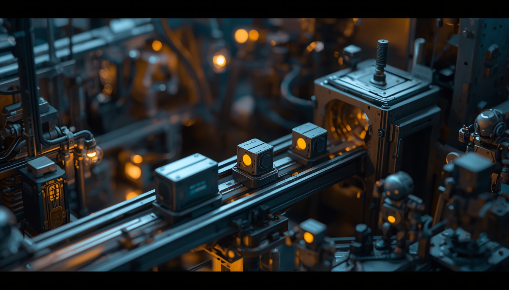

# 不是換模型，而是換執行者



昨天談的是 Agent 的生命週期：Client 可以離開，Station 仍然保存 session、event 與 process ownership。

但一個 Agent 活得比視窗久，不代表它一定能把工作做完。長時間執行時，真正中斷流程的可能不是程式錯誤，而是 provider 的 session limit、五小時額度、weekly quota 或暫時性網路失敗。原本的 Client 還在、Station 也還在，負責工作的 Agent CLI 卻已經不能繼續。

Day 003 最後承諾要把「修改 → 編譯 → 測試 → Play Mode → Build」拆成 Unity orchestration 流程。在真的拆解前，Day 004 先補上一個會橫跨所有階段的問題：**如果執行者中途被額度切斷，如何換另一個執行者，又不把原本的 worktree、工作內容與責任鏈一起換掉？**

BearPunch 目前的答案叫做 **Agent Family Ladder**。

## 一條長流程，可能不是死在程式錯誤

這不是先想像出一套彈性架構，再尋找使用情境。BearPunch 的 dogfood 過程已經遇過 Claude account session limit、Kilo 的使用窗口，以及 OpenCode／Ollama Cloud weekly limit。原本的處理方式是由 coordinator 人工讀取狀態，挑下一家 Agent，再帶著原本的 worktree 重新派工。

問題在於，這些手動切換正好發生在最需要保持 context 的時刻。Agent 可能已經改了一半程式、留下未提交變更，或正準備進入下一個 verification gate。若重新派工時遺失 brief、base revision 或 worktree owner，表面上只是「換一家繼續」，實際上已經變成另一份無法追溯的工作。

不過，必須先分清楚兩種完全不同的失敗：

- **工作結果失敗**：C# compile error、test failure、Play Mode assertion 或 Build failure。這表示目前產物不符合 gate，應該停下來診斷。
- **執行者失敗**：Agent CLI 被 quota、rate limit、provider overload 或暫時性網路中斷。工作本身未必錯，只是原執行者暫時無法繼續。

Family Ladder 要處理的是第二種，不是看到任何紅燈就換一家重跑。

## 先把三層「選擇」分開

「自動換 Agent」很容易被誤解成 multi-model routing。BearPunch 刻意把三層問題分開：

```text
Unity workflow policy
修改 → 編譯 → 測試 → Play Mode → Build
                 │
                 ▼
BearPunch run ownership + Family Ladder
claude → kilo → kiro-cli → opencode → codex
                 │
                 ▼
OmniRoute model / provider connection routing
只存在於支援這條路徑的 Agent CLI 內部
```

最上層決定開發流程有哪些 stage、完成條件與人工 gate。這仍是後續要建立的 Unity orchestration policy。

中間的 **family** 指的是一個 Agent CLI／runtime／authentication profile，例如 Claude Code、Kiro CLI 或 OpenCode。Family Ladder 決定哪一個 profile 承接 BearPunch run，以及原執行者遇到可重試的 provider failure 時，下一個 run hop 交給誰。

最下層才是 model 或 provider connection routing。ADR-0021 已經把這個責任留在 Station 外，由 OmniRoute 之類的 gateway 處理。Family Ladder 不挑 model，也不依 latency、價格、品質或「誰比較擅長 Unity Shader」評分。

因此，這篇談的不是「換模型」，而是「換一個能繼續操作同一份工作環境的執行者」。

## Ladder 為什麼要是資料？

如果 family 順序直接寫死在 Rust，系統很快就會把某一個人的訂閱、帳號狀態與偏好誤當成產品規則。BearPunch 把 ladder 放在 `projects/station/ladders/*.toml`，和 profile、connector 一樣成為 runtime data。

目前 `default.toml` 的核心形狀大致如下：

```toml
name = "default"
reentry_min = 0.05
exit_cutoff = 0.02
max_attempts = 2

[[rung]]
profiles = ["claude"]
class = "session-window"
fail = "open"
enabled = true

[[rung]]
profiles = ["kilo"]
class = "hourly-window"
fail = "open"
enabled = true
```

完整預設順序是 `claude → kilo → kiro-cli → opencode → codex`。可重現測試用的 `mock` 不在真實 ladder 裡，避免 `--agent auto` 意外把正式工作交給 transcript replayer。

資料化不只代表「可以改順序」，還把幾個 policy 明確寫出來：

- `enabled` 是單純的開關，不是假裝成預算上限。
- `max_attempts` 限制一條 reroute chain 最多嘗試幾次，避免無限換家。
- `reentry_min` 與 `exit_cutoff` 形成 hysteresis，減少額度在臨界點反覆開關。
- `fail = "open"` 表示缺少 quota telemetry 時仍可 best-effort 嘗試；`subscription.toml` 則使用 `fail = "closed"`，無法證明額度狀態就不派工。

這裡的 fail-open／fail-closed 只描述「缺少 quota telemetry 時是否可用」，不是略過 permission 或 sandbox。

Station 每次都從 binary availability、typed terminal event、quota snapshot 與 run history 重新計算 family state，不持久化「目前走到第幾階」。狀態可以是 `closed`、`open`、`half-open`、`unavailable` 或 `unknown`。其中 `unknown` 特別重要：沒觀察到 quota 資料，不等於已證明健康。

目前 Claude 與 Kiro CLI 還沒有可辨識的 quota marker，所以不能被宣稱為 `closed`。在 default ladder 中，`unknown` 可以 best-effort 嘗試；在 fail-closed 的 subscription ladder 中，它們就不符合資格。這不是漂亮的 dashboard 數字，卻是比較誠實的系統行為。

## 不是所有失敗都能換一家重跑


Family selection 之前，Station 必須先分類上一個 run 為什麼停止。

| 終止原因 | 是否可進入 reroute |
|---|---|
| quota、rate limit、provider overload | 可以，但必須明確啟用 `--reroute` |
| 暫時性 provider network failure | 可以，仍受 attempt cap 與 eligibility 限制 |
| authentication failure、invalid request | 不可以；換一家會掩蓋設定或請求錯誤 |
| binary missing、blocked、station lost、reader failed | 不可以；應先修復執行環境或權威狀態 |
| 無法分類的錯誤 | 不可以；預設 fail closed |
| Unity compile／test／Play Mode／Build failure | 不可以；這是工作結果，不是 provider availability |

這個邊界避免系統用「韌性」之名製造更多不確定性。假設 Agent 寫出的 C# 無法編譯，自動換成另一家再執行相同流程，可能只是消耗更多 quota，還把真正需要診斷的 compile error 藏起來。

另外，reroute 不是預設行為。沒有 `--reroute` 時，run 仍照原本方式失敗並交還 coordinator。只有呼叫端明確選擇自動續接，且 failure 屬於可重試 provider class，Station 才會往下一個 eligible family 前進。

## 換執行者，不能把工作換掉

BearPunch 沒有在同一個 run ID 裡偷偷替換 Agent。每一次 reroute 都建立新的 run hop，並以 `resume_from` 指回上一個 run：

```text
run-101 / claude
        │ retryable provider failure
        ▼
run-102 / kilo / resume_from = run-101

brief hash、worktree、base revision 與 owner facts 必須相同
```

這讓每一段 event、provider usage 與 failure reason 都能歸屬到正確執行者，同時保留「它們其實是同一份工作」的 lineage。

切換前，Station 也必須先回收上一個 run 的完整 process tree。若還有 child process 存活，就拒絕啟動下一個 hop。否則兩家 Agent 可能同時寫入同一個 worktree，讓 Day 003 建立的 process ownership 保證失效。

對 verifier 還有另一道界線：`run verify --agent auto` 會先排除 writer 所屬的 family，原本的 writer-family 不等於 verifier-family 檢查仍是最後守門。Ladder 提供候選，不取消治理規則。

## 從 OmniRoute 借 pattern，不借 routing engine

ADR-0022 的標題特別寫了 borrowed from OmniRoute。這裡的「借」是研究一個已經處理 subscription fallback 的 reference design，再把適合 Agent CLI 的部分重新實作；不是把 OmniRoute routing code 搬進 Station。

| 借用的 pattern | 沒有照搬的能力 |
|---|---|
| ordered ladder 是資料，不在程式裡硬編順序 | model／provider connection scorer |
| 先判斷 resilience state，再選 candidate | latency、cost、quality、task-fit ranking |
| missing telemetry 可選 fail-open 或 fail-closed | 同一個 HTTP request 內的 speculative fallback |
| `unknown` 不冒充健康或耗盡 | billing catalog 與 spend budget |
| cooldown、reset clamp 與 hysteresis | 免費的 half-open HTTP probe |
| failure classification 先於 retry | 直接 vendoring 或 line-by-line port |

兩邊的 probe 成本也不同。Gateway 可以送一個 bounded HTTP probe；Agent family 的 half-open probe 則是下一份真實工作，會進入 worktree、可能修改檔案，也算一次 attempt。

BearPunch 可以用 `station families --gateway-preview` 額外讀取 OmniRoute 的 route preview，但結果只是 advisory display，不參與 `resolve_auto` 的 family 決策。Station 仍不接管 model routing。

## 今天完成到哪裡，證據還缺什麼？

截至 2026 年 9 月 4 日，ADR-0022 已經 Accepted，IP-031 也已合併到本機 `main`。目前可以從 committed code 與 evidence 驗證：

- `station families` 可以預覽完整 candidate table，不 spawn Agent，也不寫入 run storage；但可能做 bounded quota connector read，所以不能說是完全零 I/O。
- `run create --agent auto[:ladder]` 與 `run verify --agent auto` 已接上 deterministic family selection。
- opt-in `--reroute` 已建立新的 run hop、`resume_from` lineage、owner invariant 與 process-tree reap。
- recorded／mock D1 scenario 已證明 quota event 會打開一個 rung，下一個 eligible family 可以接手。
- IP-031 當時的 verification head 記錄 374 個 tests 與 8/8 gates 通過。

同樣重要的是，還不能宣稱 production-ready：

1. 還沒有一筆真實 provider quota event 觸發 genuine cross-family reroute 的完整證據。
2. 本機 OmniRoute gateway 當時沒有 provider connection，route preview 回傳 500；測試如實記錄 divergence，但沒有完成 2xx positive golden comparison。
3. Claude、Kiro CLI 等 family 的 quota telemetry 仍是 `unknown`。
4. 374 tests／8 gates 是 IP-031 驗證當下的結果，不等於之後最新 `main` 的完整 gate 已重新通過。

所以今天交付的是一套已接受、已合併、可預覽且有 mock evidence 的韌性機制；真實額度事故下的 operational acceptance 仍然開著。

## 回到 Unity：Ladder 保護的是執行者連續性

現在可以把 Day 003 承諾的 Unity 流程放回正確層次：

```text
Pipeline policy：修改 → 編譯 → 測試 → Play Mode → Build
Stage contract：每一步需要哪些 tool、event、evidence 與 approval gate
Run authority：Station 保存 session、process、worktree 與 lineage
Executor continuity：Family Ladder 決定誰承接或續接 run
Model routing：若該 Agent CLI 支援，再由外部 gateway 處理
```

如果 Agent 在修改階段遇到 provider rate limit，Family Ladder 可以在保留同一 worktree 的前提下，讓另一個 family 建立新的 run hop繼續工作。如果 Unity compilation 已經執行並產生錯誤，則不應換 family 假裝重試；compile error 本身就是下一個要診斷的 evidence。

因此，Family Ladder 不會操作 Unity Editor，也不會替我們定義測試或 Build pipeline。它補上的是更底層的保證：**長流程尚未結束時，執行者可以更換，但工作 identity、process ownership 與驗證責任不能跟著漂移。**

下一篇才會真正把 Unity 的「修改 → 編譯 → 測試 → Play Mode → Build」逐段拆成 tool、session、event 與 gate，看看第一條可由 Agent orchestration 的 Unity vertical slice 應該長什麼樣子。
