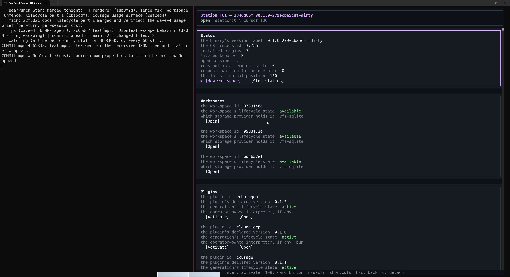

# 畫面也是受治理的 Effect：追一顆 Plugin Action 穿過 Station

Day 005 先固定了一條邊界：behavior 可以替換，但 authority、identity、lifetime 與 failure evidence 不能跟著漂移。

昨天結尾留下的下一個問題，是當 plugin 不只在背景執行 command，而是第一次把 view 與 action 帶進 Station 時，這條邊界還守不守得住。

今天不再重畫一次 Plugin-First 全景，也不把「plugin 可以提供 UI」當成答案。真正要追的是一顆按鈕：它從 plugin 宣告的 surface 出現在通用 renderer 裡，被使用者觸發，再回到 Station 的 generation、dispatch 與 grant 檢查。若畫面可以繞過其中任何一層，plugin UI 只是把 domain switch 從 host 搬進 client，並沒有建立新的 architecture boundary。

> **畫面可以由 plugin 貢獻，但 action 不能因此獲得第二條 authority path。**

## 昨天留下的 Gate，今天變成一條 Vertical Slice

先校正今天討論的 repository 基準。

`bearpunch-star` 的 current `main` 已經把目前可運作的主線收斂到 **resident process plugin**：Station 保存 package 與 generation，透過 NDJSON JSON-RPC／AEP 與長駐 plugin process 溝通，activation handshake 回報 runtime 實際提供的 effective contributions。

這和昨天用來說明 runtime boundary 的 Wasm／native 形狀不是同一個完成狀態。今天可以由 current code 與 evidence 支持的範圍是：

| 可以驗證 | 不能因此宣稱 |
|---|---|
| process plugin publication、activation 與 effective contributions | Wasm adapter 已接進 current runtime path |
| Windows Job 對 process tree 的監督與回收 | filesystem／network 已完整 deny-by-default |
| Bun／Node interpreter 由 operator 配置 | `.NET` plugin 已通過整合 gate |
| semantic IR、plugin surface、通用 OpenTUI renderer | 完整的 plugin marketplace 或 surface picker 已完成 |
| view action 經既有 dispatch 與 capability recheck | UI command 已等同 durable invocation |

這個 vertical slice 的價值，不是多了一張 dashboard，而是 Day 005 規劃中的 plugin-contributed view 已從 Pencil、token seed 與 design proposal，跨進 committed protocol、Station control flow、renderer 與負向測試。

## Surface 不是畫面，而是一份 Contribution

若 host 直接看 plugin ID 決定要畫什麼，架構最後很容易變成：

```text
if plugin == "ccusage" {
    render_usage_panel();
} else if plugin == "unity" {
    render_unity_panel();
}
```

這只是把 plugin behavior 重新寫回 client。

Current contract 走的是另一條路。Plugin manifest 可以宣告 command、agent 與 view contributions；view 指向一份 surface asset。Admission 不只確認檔案存在，還會驗證 surface 是否符合 semantic IR，以及裡面的 intent 是否只綁定該 plugin 自己宣告的 command。

概念上的責任分工是：

```text
Plugin package
  ├─ declared commands
  ├─ declared views
  └─ semantic surface asset
          │
          ▼
Manifest admission
  ├─ schema validation
  ├─ component／binding validation
  └─ intent 必須指向同一個 plugin 的 command
          │
          ▼
Activation handshake
  └─ 保存 runtime 實際可用的 effective contributions
```

這個限制看似保守，卻阻止一份 surface 把任意 host command 包裝成自己的按鈕。View contribution 是 plugin contract 的一部分，不是 client 收到一段資料後自行猜測的特殊案例。

Production `ccusage` plugin 已經帶有 committed 的 `usage` surface，顯示 totals、today、目前 five-hour block 與 model breakdown。重要的不是這些欄位，而是它和測試中的 surfaced plugin 走同一份 contract；renderer 不需要新增 `ccusage` 分支。

## Renderer 不應該認得 ccusage

Station 會解析 live read model，把 semantic surface lowering 成 A2UI v0.9 operations；OpenTUI 只負責折疊 `createSurface`、`updateComponents` 與 `updateDataModel`，再渲染 Text、Row、Column、Card、List、Button 等通用 component。

換句話說，資料的 domain meaning 留在 plugin 與 Station read model，client 只理解 presentation contract：

```text
Plugin contribution
        │
        ▼
Semantic IR + live data
        │
        ▼
Station lowering
        │
        ▼
A2UI operations
        │
        ▼
Generic OpenTUI renderer
```

這裡有一條很實際的 regression gate：`noLowering` 測試禁止 domain read-model 或 event 名稱重新長進 renderer。因為只要 client 開始認得 `ccusage.total`、`unity.build` 或某個特定 plugin ID，Plugin-First 就會在使用者看得見的最後一哩失效。

目前這條路已能直接 `view.open ccusage/usage`，但 OpenTUI shell 還沒有讓一般使用者探索所有 plugin surfaces 的 picker。**能被 protocol 開啟與通用渲染，不等於完整 navigation UX 已完成。**

## 追一顆按鈕：Action 沒有第二條捷徑

畫面只是 read side；真正容易穿透 boundary 的是 action。

Plugin surface 裡的 Button 不直接持有 function pointer，也不能呼叫 renderer 內的 domain handler。使用者觸發 intent 後，路徑是：

```text
Button intent
    │
    ▼
view.act(instance, intent, context, args)
    │
    ├─ 找回 instance 綁定的 PluginId + GenerationId
    ├─ 確認該 generation 仍是 current
    ├─ 驗 intent、context 與 args schema
    ▼
既有 Station dispatch（沿用同一個 client identity）
    │
    ▼
command.invoke
    │
    ▼
resident plugin process
    │
    ▼
plugin 發出 AEP effect request
    │
    ▼
以 generation 查 current grant，再決定允許或拒絕
```

`view.open` 建立的 instance 會記住 `(PluginId, GenerationId)`。這不是 renderer 自己保存的一個字串，而是 stale-view 判斷的依據。`view.act` 在 dispatch 前重新確認 generation，然後把 command 送回原本的 Station control path；plugin 若再要求 `log.write`、workspace access、event publish 或 interaction，capability router 仍會以 generation 與 current grant 重新判斷。

所以 action 並沒有因為來自 UI 就比較可信。Surface 能描述「使用者想做什麼」，但不能決定「這個 effect 是否被允許」。

這裡也必須說清楚目前的缺口：`command.invoke` 現在 mint 的 RunId 沒有寫入 kernel durable run record。需要 run-scoped lookup 的 capability 會因找不到 run 而失敗；目前 vertical slice 證明的是像 `log.write` 這類非 run-scoped effect，而不是完整的 durable invocation lifecycle。

因此正確說法是：**UI action 已回到既有 dispatch 與 grant path，但還沒有完成 Day 005 所要求的 durable invocation identity。**

## Replace、Revoke、Unpublish 時，畫面要怎麼失效？

Happy path 只能證明一顆按鈕按得下去；Plugin-First 要看的，是 authority 改變後舊畫面會不會繼續假裝有效。

| 變化 | 畫面／action 應有結果 | 原因 |
|---|---|---|
| plugin 被新 generation 取代 | 舊 view instance 回 `gone` | instance pin 的 generation 已不是 current |
| operator 撤銷 effect capability | 同一 action 在 effect-time 回 `denied` | surface intent 不是 grant |
| plugin 被 unpublish | contribution 從 catalog 消失，舊 instance 不可再操作 | current route 與 effective contribution 已移除 |
| renderer 持續執行時 publish 新 plugin | 不重啟 renderer，也能以同一通用 contract 顯示 | client 不含 plugin-specific lowering |

OpenTUI integration evidence 正好把這四件事串在一起：測試在 renderer 執行中 publish 一個帶 surface 的 JavaScript plugin，它出現在 `view.list`、由同一 renderer 畫出，action 經 `view.act` 成功；撤掉 `log-write` 後，同一 action得到 `DENIED`；unpublish 後，surface 從 catalog 消失。Rust 端另有 stale generation 回 `GONE` 的測試。

這些負向結果比一張成功截圖更重要。它們證明 view 沒有把 authority cache 在 component tree，也沒有在 client 裡留下 unpublish 後仍可呼叫的 hidden handler。

## Evidence：不是 Pencil，也不是一張漂亮截圖



這張實機截圖能直接證明 TUI 已連上 Station，並讀出 workspace 與 plugin generation 的 live 狀態；但畫面中的 binary version 帶有 `dirty`，左側也包含尚未合併的 MPS watcher 紀錄。因此它是 runtime snapshot，不是 clean-release receipt，更不能單靠一張畫面證明 surface admission、action dispatch、revoke 與 unpublish 的 contract。那些仍要回到下列 source 與測試證據。

截至今天，這條 vertical slice 可以分成幾層 committed evidence：

1. **Protocol contract**：semantic IR schema v2、view contribution、`view.list/open/update/close/act`、`command.invoke` 與 AG-UI event projection。
2. **Station control flow**：surface admission、live read-model resolution、A2UI lowering、per-connection view instance、generation check 與 action dispatch。
3. **Generic renderer**：OpenTUI 不認 domain，只處理通用 components、roles 與 intents。
4. **Runtime integration**：執行中 publish surfaced plugin、render、act、revoke、unpublish，不重啟 renderer。
5. **Production artifact**：`ccusage` 已有 committed `usage` surface，不只存在於 test fixture。

Repository-recorded gate 顯示：

- OpenTUI fixture 修正後為 **48／48**；
- renderer cast gate 為 **22／22 PASS**；
- 後續包含這些變更的 Station CI 記錄為 **87 suites**。

這次撰文只核對 current source 與既有 evidence，沒有重新跑完整 gate。因此不能把 87 suites 寫成 87 個 tests，也不能把不同 checkpoint 的數字相加成今天的總測試數。

同樣地，`design/bearpunch.pen` 是 visual source，不是 runtime 讀取的 plugin UI；尚未合併的 MPS authoring worktree 也不能算 current main 能力。能畫出設計稿、能生成 IR、能在 Station admission、能由 renderer 執行，是四種不同證據。

## 這條邊界還有哪些洞？

Plugin view 已經跨過第一個 vertical slice，但還不能把它包裝成完整產品：

- **缺少 discovery UX**：OpenTUI 尚無 plugin-surface picker，目前以 direct `view.open` 與 integration gate 為主。
- **缺少 durable action invocation**：`command.invoke` 尚未建立 kernel run record，run-scoped capability 也因此不完整。
- **Activation 還不是 runtime-handshake atomic**：pre-admission 的 manifest、hash、interpreter 錯誤不會留下 generation；但 generation publication 之後才做 process provisioning 與 handshake，失敗可能留下 current／failed generation。這還沒有完全達到 Day 005 所寫的「錯誤 candidate 不影響 current route」。
- **Confinement 仍有限**：Windows Job 能治理 process tree，不等於已隔離所有 filesystem／network effect；部分 directory-access plugin 仍能碰到 host-visible path。
- **Runtime breadth 尚未成立**：Wasm 是 later tier，`.NET` 目前只是 interpreter kind，不能宣稱已驗證 adapter 或 plugin SDK。
- **UI 不是完整 security boundary**：surface admission 與 capability recheck 可測，但不代表 hostile-code security audit 已完成。

把這些限制寫出來，不是降低今天成果，而是讓下一步有可被推翻的 gate。

## 從 Plugin View 回到 Unity 的 Evidence Surface

這個系列最終仍要回到 Unity Game Dev orchestration，而不是停在一般 plugin framework。

Plugin-contributed view 提供了一條可能的接法：未來 Unity plugin 可以交付自己的 project evidence surface，顯示修改、編譯、測試、Play Mode 與 Build 的狀態；OpenTUI 仍只渲染通用 component，不新增 `if plugin == "unity"`。使用者按下重跑測試、開啟 failure evidence 或要求 build 時，action 仍回到 Station 的 generation、workspace、toolchain grant 與 durable run。

但這目前只是下一個 vertical slice，不是已完成能力。它至少要通過：

1. Unity plugin 以 manifest contribution 交付 surface 與 commands；
2. action 建立真正 durable、可 restart recovery 的 Station run，而不是 ephemeral `command.invoke`；
3. toolchain、workspace 與 interaction effects 都在 current grant 下重新檢查；
4. replace、revoke、unpublish 與 renderer reconnect 都有負向測試；
5. shell 能探索 plugin surface，而不是依賴 direct open；
6. headed TUI gate 能證明真實鍵盤操作、更新與 failure evidence。

在這些條件成立前，今天完成的是 plugin UI authority path 的第一段，不是 Unity workflow 的交付。

Day 005 的問題是：哪些 behavior 可以替換，哪些 authority 必須留在 Station。Day 006 把同一個問題推到使用者面前後，答案沒有改變：

> **Renderer 可以不知道 plugin 是誰；Station 不能不知道 action 屬於哪一個 generation、使用哪一版 grant，以及失效時該回 `denied` 還是 `gone`。**

畫面若真的是 plugin 的一部分，它就不只要能被畫出來，也要能被安全地撤回。
